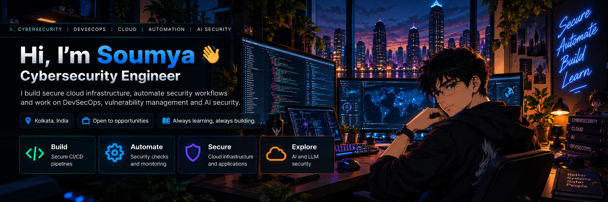

 

### BUILD • AUTOMATE • SECURE • EXPLORE

**Cybersecurity Engineer focused on cloud security, security automation, DevSecOps, vulnerability management and AI security.**

---

## 🛡️ TryHackMe

---

## 🛠️ Tech Stack

  

---

## 🔐 What I Work On

<table width="100%">
<tr>

<td width="35%" align="center" valign="top">

<h3>🟢 BUILD</h3>

Secure CI/CD 
pipelines

</td>

<td width="35%" align="center" valign="top">

<h3>🔵 AUTOMATE</h3>

Security checks 
and monitoring

</td>

<td width="35%" align="center" valign="top">

<h3>🟣 SECURE</h3>

Cloud infrastructure 
and applications

</td>

<td width="20%" align="center" valign="top">

<h3>🟠 EXPLORE</h3>

AI &amp; LLM Security

</td>

</tr>
</table>

---

## 🎯 Currently Focusing On

☁️ **AWS Cloud Security** &nbsp;&nbsp;  
⚙️ **Security Automation** &nbsp;&nbsp;  
🤖 **AI and LLM Security** &nbsp;&nbsp;  
🛡️ **Vulnerability Management** &nbsp;&nbsp;  
🔐 **DevSecOps** &nbsp;&nbsp;  
🏗️ **Cloud Infrastructure Security**

---

# 🚀 Featured Projects

<table width="100%">
<tr>

<td width="50%" valign="top">

## 🔒 DevSecOps Security Pipeline

A 5 stage CI/CD security pipeline built with GitHub Actions using automated security scanning, security gates, vulnerability detection and CVE remediation.

**Tech:** GitHub Actions • Trivy • Semgrep • Gitleaks • Python • NVD API

[View Project](https://github.com/SoumyaKhaskel/devsecops-pipeline-IECSL)

</td>

<td width="50%" valign="top">

## 📊 Security Audit Dashboard

A live security observability dashboard that ingests CI/CD security results and provides a weighted security score, findings breakdown and deployment history.

**Tech:** Python • Spring Boot • React • PostgreSQL • AWS EC2

[View Project](https://github.com/SoumyaKhaskel/Cyber-Security)

</td>

</tr>

<tr>

<td width="50%" valign="top">

## 🤖 Cybersecurity News Agent

An autonomous AI agent that collects cybersecurity news, summarises articles, assigns severity and delivers alerts through Telegram.

**Tech:** Python • FastAPI • Llama • SQLite • Telegram Bot API

[View Project](https://github.com/SoumyaKhaskel/cybersec-news-agent)

</td>

<td width="50%" valign="top">

## 🌐 Network Performance Optimization

A practical network optimization project focused on diagnosing latency spikes and improving network performance through packet level analysis and protocol tuning.

**Tech:** QoS • DNS • TCP/IP • MTU • Packet Analysis • Linux

[View Project](https://github.com/SoumyaKhaskel/Network-router-optimization)

</td>

</tr>
</table>

---

# ☁️ Security Engineering

<table width="100%">
<tr>

<td width="50%" valign="top">

### Cloud Security

- AWS EC2
- IAM
- VPC
- WAF
- Linux Hardening
- Least Privilege
- Infrastructure as Code

</td>

<td width="50%" valign="top">

### DevSecOps

- GitHub Actions
- SAST
- SCA
- Secrets Detection
- CI/CD Security Gates
- Trivy
- Semgrep
- Gitleaks

</td>

</tr>

<tr>

<td width="50%" valign="top">

### Security Engineering

- Vulnerability Management
- CVE Remediation
- CWE and CVSS Analysis
- Threat Modeling
- Risk Assessment
- ISO/IEC 27001

</td>

<td width="50%" valign="top">

### AI Security

- AI and LLM Security
- Prompt Injection
- Jailbreaking Defense
- Agentic AI
- AI Security Automation
- LLM API Integration

</td>

</tr>
</table>

---

# 🏆 Certifications

| Certification | Status |
|---|---|
| 🎓 Certified Ethical Hacker | Completed |
| 🔐 Microsoft Azure Security Engineer Associate AZ-500 | Completed |
| 🤖 AWS Certified AI Practitioner | In Progress |
| 🧠 Claude Certified Architect Foundations | In Progress |
| 🛡️ TryHackMe AI Security Certification | Completed |
| 🔎 Google Cybersecurity Professional Certificate | Completed |
| 🌐 Network Forensics and PCAP Analysis | Completed |
| 🕵️ OSINT for Defenders | Completed |
| 🌑 Dark Web Operations and Threat Intelligence Collection | Completed |

---

# 📊 GitHub Stats

---

# 🧠 Currently Learning

☁️ **AWS Security** &nbsp; • &nbsp;
⚙️ **Cloud Automation** &nbsp; • &nbsp;
🤖 **AI and LLM Security** &nbsp; • &nbsp;
📡 **Security Monitoring** &nbsp; • &nbsp;
🏗️ **Infrastructure Security** &nbsp; • &nbsp;
🧩 **Agentic AI**

---

# ✍️ Technical Work

I enjoy documenting practical experiments, security research, troubleshooting and engineering projects.

---

# 🤝 Let's Connect

---

### Secure. Automate. Build. Learn.

